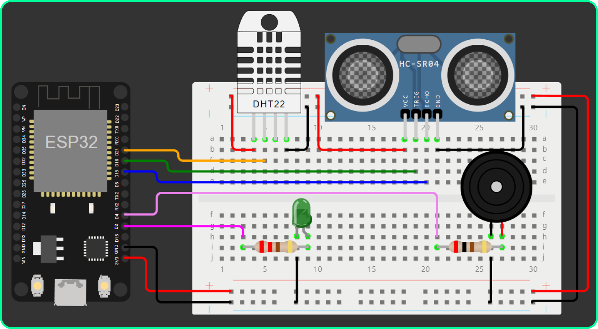
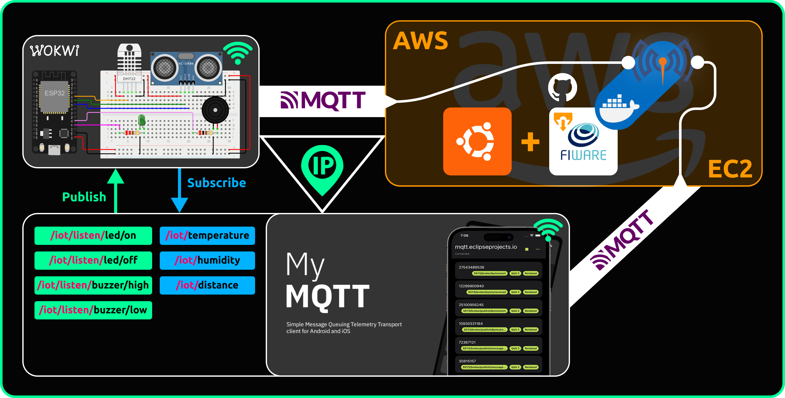

# INTEGRANTES
- **Guilherme Santos Nunes** | 558989
- **Kaique Rodrigues Zaffarani** | 556677
- **Kairo da Silva Silvestre de Carvalho** | 558288
- **Rafael Menezes Viana** | 558287

## LINKS
- **[SIMULADOR](https://wokwi.com/projects/411876289650649089)**

<br>

# PROJETO
Este projeto visa conectar um Simulador (montado no site Wokwi) a uma instância EC2 (máquina virtual da Amazon Web Services) com o sistema operacional Ubuntu e um repositório do GitHub clonado que simplifica serviços da plataforma de código aberto FIWARE. O repositório apresenta contêineres Docker (aplicações de código isolada) e para o sistema foi utilizado o Mosquitto (broker MQTT) diretamente de um contêiner Docker para viabilizar a comunicação com o Simulador por meio do aplicativo MyMQTT.

A estrutura do sistema IoT é baseada em três pilares principais:

- **Simulador** | Conecta sensores e atuadores ao ESP32 (microcontrolador do Simulador) e transmite os dados via protocolo de comunicação MQTT para o EC2.
  
- **EC2** | Máquina virtual que com o Ubuntu instalado e atuando como servidor manipula e envia dados recebidos do Simulador por meio do Mosquitto.

- **MyMQTT** | Aplicativo que inscreve ou publica em tópicos MQTT (previamente estabelecidos no Simulador) por meio de conexão de IP (Internet Protocol) do EC2 para o Simulador, permitindo o controle de seus sensores e atuadores.

<br>

# INSTRUÇÕES
1. Em um terminal, clonar o repositório:
```bash
git clone https://github.com/Z4ffarani/IoThunder.git
```

2. No terminal, navegar até a pasta do projeto:
```bash
cd IoThunder
```

3. O documento ``criacao-servidor-e-maquina-virtual``, localizado na pasta ``docs``, informa o passo-a-passo necessário para criar uma máquina virtual (podendo ser tanto localmente quanto em nuvem por meio do provedor de infraestrutura de preferência), instalar o Ubuntu (distribuição Linux de preferência) e clonar o repositório do GitHub com serviços do FIWARE, configurando-os em contêineres Docker (obrigatório).

4. Para rodar o Simulador, seguir o link disponibilizado e clicar no botão de iniciar. Levará algum tempo até que o simulador se conecte à rede pública do Wokwi e ao EC2. É possível regular os níveis de condição relacionados aos sensores clicando neles, para que assim sejam registrados no EC2 e enviados para o MyMQTT. Para utilização física, é necessário executar o código presente no arquivo ``simulador.ino`` na pasta ``docs``, assim como instalar as bibliotecas dos sensores presentes na pasta ``libraries``. O programa [Arduino IDE](https://www.arduino.cc/en/software) é adequado para o teste.

5. Instalar o aplicativo [MyMQTT](https://mymqtt.app/en), ou qualquer outro que permite conexão de endereço IP e porta 1883 de uma máquina virtual. No aplicativo, Caso a mensagem de publicação (Publish) no tópico MQTT `iot/listen` for `led/on`, o LED liga no Simulador e desliga com `led/off`. Se a mensagem no mesmo tópico for `buzzer/high`, o Buzzer é acionado em uma frequência aguda e com `buzzer/low`, uma frequência grave, ambas em um intervalo de 500 millisegundos.

<br>

# FUNÇÕES

`docs/simulador.ino`:
- **Inclusão de bibliotecas** | Importa as bibliotecas necessárias para a operação do ESP32 e para a comunicação com os sensores, permitindo o uso de funções específicas para cada tipo de sensor conectado.

- **Definição de portas de entrada** | Estabelece as portas digitais e analógicas do ESP32 que serão usadas para conectar e ler os dados dos sensores, garantindo a correta configuração do hardware.

- **Referenciamento e leitura dos sensores** | Configura e lê os dados dos sensores DHT22 e HC-SR04, processando as informações de temperatura, umidade e distância.

- **Constantes de endereços** | Recebe valores que permitem a comunicação do sistema, como rede WiFi, endereço IP da máquina virtual e porta do broker MQTT.

- **Constantes de tópicos MQTT** | Recebe rotas que permitirão comunicação com o broker através de inscrição e publicação de informações.

- **Funções de inicialização** | Partida do módulo WiFi do ESP32, broker juntamente com seus futuros tópicos e sensores do Simulador.

- **Funções de publicação** | Permitem enviar dados dos sensores através de seus respectivos tópicos para a máquina virtual.

- **Callback MQTT** | O broker traz mensagens inscritas em um tópico no MyMQTT para o Simulador. A função interpreta-as por meio de condicionais e as cumpre para o atuador escolhido destinado ao tópico.

- **Funções de verificação em loop** | Averigua conexão WiFi para Simulador e MQTT para o broker, além de confirmar com mensagens na Serial do Simulador. 

<br>

# DIAGRAMA


<br>

# MONTAGEM DO SIMULADOR
- **1x** Cabo USB A - **R$15,00**
- **1x** ESP32-DevKitC V4 [**(Documentação)**](https://docs.espressif.com/projects/esp-idf/en/stable/esp32/hw-reference/esp32/get-started-devkitc.html) - **R$50,00**
- **1x** Sensor de distância ultrassônico HC-SR04 [**(Documentação)**](https://web.eece.maine.edu/zhu/book/lab/HC-SR04%20User%20Manual.pdf) - **R$13,00**
- **1x** Sensor de umidade e temperatura (DHT22) [**(Documentação)**](https://www.mouser.com/datasheet/2/737/dht-932870.pdf?srsltid=AfmBOorSkF-0gQ-mg5eU7CV1wMu6Tfkj42UYvsNNHSDjhMDF8vXLC82A) - **R$40,00**
- **1x** LED verde difuso de 5mm - **R$0,50**
- **1x** Piezoeletric buzzer ativo de 5V [**(Documentação)**](https://wiki-content.arduino.cc/documents/datasheets/PIEZO-PKM22EPPH4001-BO.pdf) - **R$4,00**
- **1x** Resistor de 220 Ω (ohms) - **R$2,00**
- **1x** Resistor de 200 Ω (ohms) - **R$2,00**
- **1x** Placa de ensaio (de preferência com 830 pontos) - **R$20,00**
- **15x** Cabos Jumper macho-macho (contados com a placa de ensaio incluída) - **R$3,00**
- **TOTAL - R$149,50**

<br>

# OBSERVAÇÕES 
- Os preços dos componentes do Simulador estão sujeitos a valorização ou desvalorização.

- Para o Simulador físico, o uso contínuo de sensores pode resultar em um maior consumo de energia. É considerável implementar modos de economia de energia, como intervalos de sono, para prolongar a vida útil da bateria se o sistema for alimentado por bateria.

- A estabilidade da conexão Wi-Fi é fundamental para o funcionamento do sistema. Para o Simulador físico, verifcar se o módulo ESP32 está dentro do alcance da rede sem fio para garantir a transmissão de dados confiável é importante.

- As bibliotecas escolhidas para o Simulador têm recursos ainda mais complexos para serem implementados.
  
- É preciso alterar o endereço IP e porta do broker MQTT no Simulador para que assim conecte com a máquina virtual escolhida.

- É essencial configurar o Mosquitto corretamente na máquina virtual para permitir a comunicação entre o Simulador e o MyMQTT. Testes prévios com o Postman ajudarão a validar dependências instaladas.
  
- Existe a possibilidade de renomear e alterar as funcionalidades dos tópicos MQTT no Simulador para atender necessidades diversas na aplicação IoT, tal qual os sensores e atuadores dispostos.
  
- Para a máquina virtual em nuvem, dependendo do provedor de infraestrutura escolhido, é importante averiguar valores e planos gratuitos a virarem pagos antes de ativar instâncias. O término da instância após aplicações de testes são recomendados para não contabilizar créditos ou futuras cobranças.

- O EC2 (máquina virtual na AWS) utilizado no projeto permanecerá parado, sendo necessário criar uma máquina virtual rodando em qualquer outro provedor para uma aplicação IoT própria.

<br>

# TECNOLOGIAS
[](https://www.arduino.cc/en/software)


<br>

# REFERÊNCIAS
- **[FIWARE Descomplicado](https://github.com/fabiocabrini/fiware)**
- **[Instalação de bibliotecas no Arduino IDE](https://docs.arduino.cc/software/ide-v1/tutorials/installing-libraries/)**
- **[How to Create an EC2 Instance in AWS in 2023](https://www.youtube.com/watch?v=0Gz-PUnEUF0&t=526s)**
- **[Aula 1 - Configuração de um dispositivo no Fiware](https://www.youtube.com/watch?v=8oHkAlXdWo8)**

<br>

# AGRADECIMENTOS
- **[Paulo Marcotti](https://www.youtube.com/@pmarcotti)**
- **[Fábio Henrique Cabrini](https://github.com/fabiocabrini)**